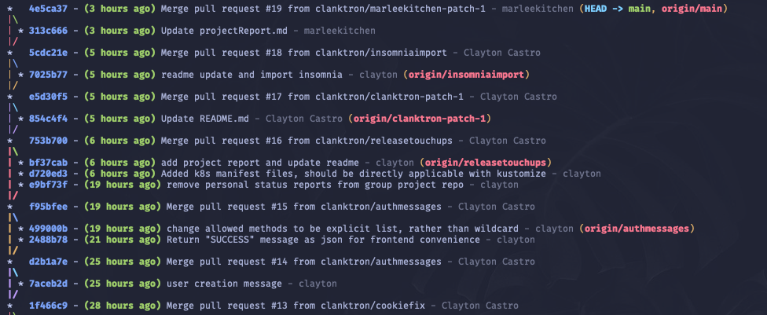
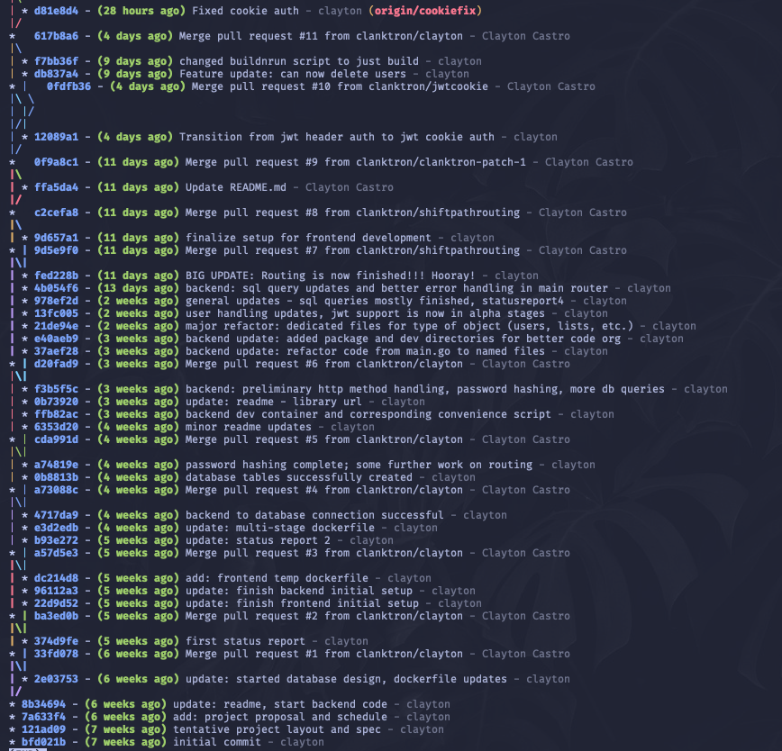
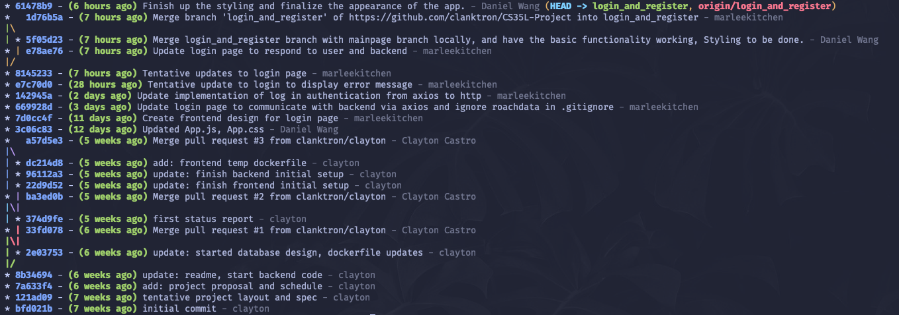
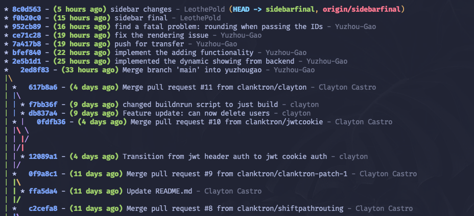
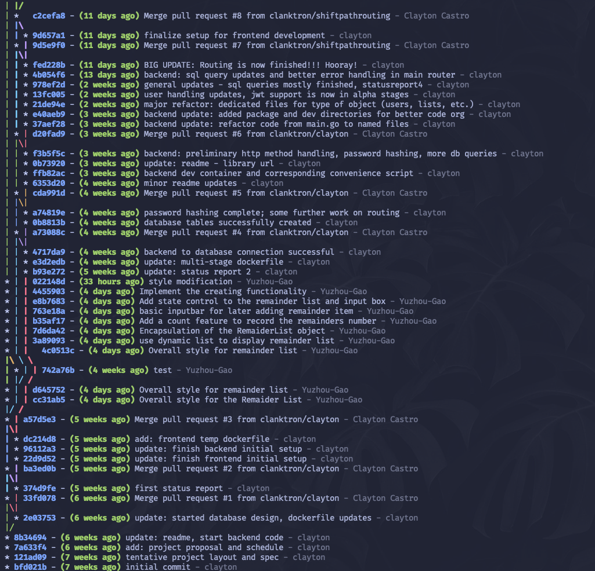

# Git Commit History

>Note: The formatting of this document is a little weird since markdown to pdf conversion is a little wonky without custom css. 
If you want a better view of this file go to the repo https://github.com/clanktron/CS35L-Project/info/githistory.md. It matches the images
up much better so I'd recommend it.

Our general approach was to develop features in feature branches and rapidly merge to main once the designated task had been completed.
Since frontend development was rather haphazard and never got finished (I'll be emailing a more comprehensive explanation) their branches never got merged 
and so the commit history from main doesn't show any contributions from those feature branches/developers. I've attached their commit history to the end of 
this document and you can check github for the progress of frontend code. You'll also notice their branches have lots of commits from me (Clayton). This isn't due
to me making commits in those braches, rather the frontend members would regularly rebase from main in order to get changes to the backend that I would make.
We did this rather than merging from main to a feature branch as it would keep main as the single source of truth. I also added some permission restrictions to the github
repo so the only way to update main was to start a PR.

I would add additional comments to the commit history but each commit message is self-explanatory for what it did. If you're looking for more detailed explanations for each commit 
then visit the repo as I made quite a few multi-line commit messages.

Main branch history:

Login_and_register branch history:

Sidebarfinal branch history:

